<table>
<tr>
<td valign="top"></td>
<td valign="top"></td>
</tr>
</table>

# Moinuddin Shaik

**Applied Scientist · AI Engineer · Agentic AI**

Applied Scientist and Computer Science (AI/ML) graduate focused on LLM systems,
NLP, retrieval infrastructure, and production-ready machine learning.

 

## What I Build

- LLM-powered systems for taxonomy generation, information extraction, and document intelligence.
- RAG pipelines with OpenAI embeddings, pgvector, Redis, PostgreSQL, and FastAPI.
- On-device ML applications using TensorFlow Lite, PyTorch, and model optimization.
- Applied AI products that move from prototype to measurable production behavior.

## Featured Work

**Amazon RBS Sciences**  
Built autonomous LLM-powered taxonomy generation pipelines for customer feedback analysis, including self-calibrating information extraction and explainable taxonomy evaluation.

**DocuLens AI**  
Enterprise document intelligence platform for semantic search, summarization, classification, and Q&A over 10K+ unstructured documents.

**Intel Unnati - Edge Video ML**  
Built a real-time video feed sharpening pipeline using knowledge distillation, improving edge clarity while reducing model size for low-resource deployment.

## Stack

`Python` · `SQL` · `C++` · `Java` · `TypeScript`  
`PyTorch` · `TensorFlow` · `Scikit-learn` · `Transformers` · `BERTopic`  
`RAG` · `LLM Evaluation` · `Amazon Bedrock` · `OpenAI API`  
`FastAPI` · `Docker` · `Redis` · `pgvector` · `AWS` · `GCP`
